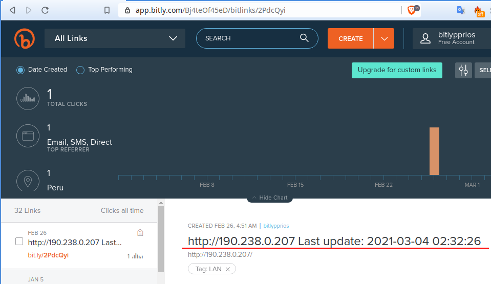

# Bitly API PATH (code BETA)

Automatization autoexecute of the file .sh bash each minute.

The IDEA was to update the URL When my ROUTER CHANGED of yout current IP (because it has a IP PUBLIC but random)
So when my Router to reboot is posible that changed to other IP. Therefore I will lose my known IP.

### WRONG

With bitly api rest  WE CAN'T update the field `long_url`  
i realized than when i started to write ( bad practice :( )

### Solution to no update the field: long_url

For moment only update the Title from ITEM LINK BITLY  
Solution1: Udating the title I kwnon for for anyway that happend when Im away from home.  
Solution2: To send me one mail  with this change  

### Config and execute:

Set your seft token (create it on your Bitly settings)

    BITLY_TOKEN=""

### IMG

